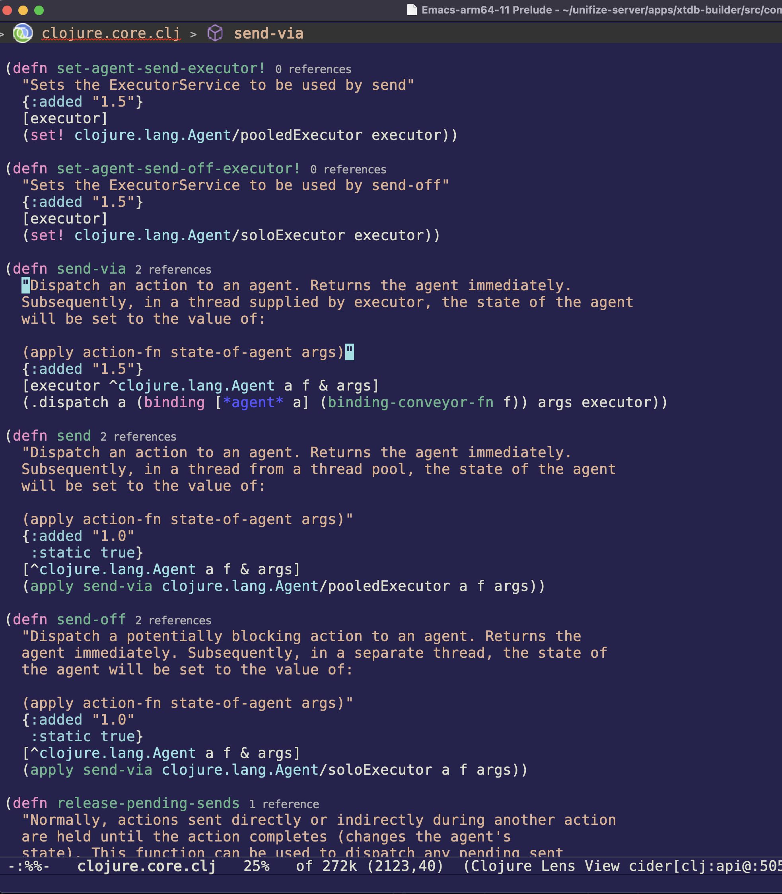

# Vaugan #

This Emacs theme, Vaugan, is a vaugan color inspired from iterm colors
theme for programmers who prefer a clean and focused coding
environment.

# Screenshot #



# Installation #

Download the theme to your local directory. You can do it through `git
clone` command:

```
git clone https://github.com/Saurav-S-Purushothaman/vaugan-emacs-theme.git
```

Then add path to vaugan-theme to custom-theme-load-path list —
add the following to your emacs config file somewhere (.emacs,
init.el, whatever):

```
(add-to-list 'custom-theme-load-path
             "/path/to/vaugan-emacs-theme/")
```

Use `M-x customize-themes` to change your current theme.

# Contribution #

Vaugan theme has a lack of support for many emacs mode. Feel free to add
appropriate color faces (see file chelsea-yellow-theme.el) and send me a
pull request. This help is much appreciated.

Thanks.
